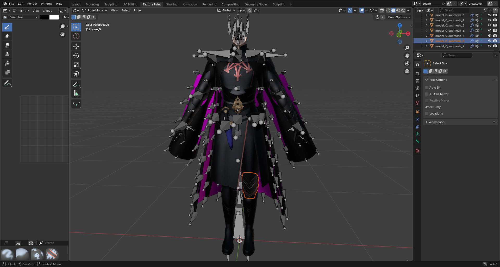

# FE3H - Model Modding

This may not be able to do much for now, besides being able to rip/get the 3D models from the game. I would have to carefully study the structure of G1M to understand how to recreate it (to be able to actually change 3D models), which is a very complex topic. The [existing tools](https://github.com/three-houses-research-team/Throne-of-Knowledge/wiki/Editing-Models) seem to have been lost.

As that wiki page explains there, what we need is the G1M files, however, these are usually in compressed binary files. The base game model files are located in `nx\action\model` (3120-4012). DLCs or updates can change or add new models (**dlc2** and **dlc6** add new models). Remember that using the updated models from the patches is recommended to get the latest versions of those models. Easiest way to decompress the "bin.gz" files is to use the [THAT](https://github.com/niltwill/fe3h-modding-tools/tree/main/Apps/THAT) app.

## Model file updates

Patch1:
 * MC032_CatherineA_0_P_Body.bin.gz
 
Patch2:
 * MC025_LeonieA_0_P_Body.bin.gz
 * MC025_LeonieA_0_P_Face.bin.gz
 * MO013_MobM_0_P_Body.bin.gz
 
Patch3:
 * MC022_LysitheaA_0_P_Face.bin.gz
 * MC024_HildaB_0_P_Face.bin.gz
 * MC030_GilbertA_0_P_Body.bin.gz
 * MC042_DeathKnightA_PC_0_P_Body.bin.gz
 * MC048_AnnaA_PC_0_P_Body.bin.gz
 * MC048_AnnaA_PC_0_P_Face.bin.gz
 * MC049_JeritzaA_PC_0_P_AwakeFace.bin.gz
 * MC049_JeritzaA_PC_0_P_Face.bin.gz
 * MT011_Sweets_0.bin.gz
 * MU006_LoadM_0_P_Body.bin.gz

Patch4:
 * MC002_EdelgardA_0_P_Body.bin.gz
 * MC006_FerdinandA_0_P_Body.bin.gz
 * MC022_LysitheaB_0_P_Face.bin.gz
 * MC024_HildaB_0_P_Body.bin.gz
 * MC049_JeritzaA_PC_0_P_Body.bin.gz
 * MC100_UlysseA_0_P_Body.bin.gz
 * MC100_UlysseA_0_P_Face.bin.gz
 * MC100_UlysseB_0_P_Body.bin.gz
 * MC100_UlysseB_0_P_Face.bin.gz
 * MC101_BalthasarA_0_P_Body.bin.gz
 * MC101_BalthasarA_0_P_Face.bin.gz
 * MC101_BalthasarB_0_P_Body.bin.gz
 * MC101_BalthasarB_0_P_Face.bin.gz
 * MC102_ConstanzeA_0_P_Body.bin.gz
 * MC102_ConstanzeA_0_P_Face00.bin.gz
 * MC102_ConstanzeB_0_P_Body.bin.gz
 * MC102_ConstanzeB_0_P_Face00.bin.gz
 * MC103_HapyA_0_P_Body.bin.gz
 * MC103_HapyA_0_P_Face.bin.gz
 * MC103_HapyB_0_P_Body.bin.gz
 * MC103_HapyB_0_P_Face.bin.gz
 * MO000_FaceM00_0_P_Face.bin.gz
 * MO002_FaceM02_0_P_Face.bin.gz
 * MO004_FaceM04_0_P_Face.bin.gz
 * MO005_FaceM05_0_P_Face.bin.gz
 * MO007_MobM_0_P_Body.bin.gz
 * MO009_FaceF09_0_P_Face.bin.gz
 * MO010_FaceF10_0_P_Face.bin.gz
 * MO011_FaceF11_0_P_Face.bin.gz
 * MO011_MobM_0_P_Body.bin.gz
 * MO028_FaceM28_0_P_Face.bin.gz
 * MU011_BrigandM_0_P_Body.bin.gz
 * MU013_GladiatorM_0_P_Body.bin.gz
 * MU017_BraveM_0_P_Body.bin.gz
 * MU018_SwordMasterF_0_P_Body.bin.gz
 * MU019_AssassinF_0_P_Body.bin.gz
 * MU019_AssassinM_0_P_Body.bin.gz
 * MU020_FortressM_0_P_Body.bin.gz
 * MU024_WarriorF_0_P_Body.bin.gz
 * MU024_WarriorM_0_P_Body.bin.gz
 * MU025_SniperM_0_P_Body.bin.gz
 * MU026_GrapplerM_0_P_Body.bin.gz
 * MU027_WarlockF_0_P_Body.bin.gz
 * MU027_WarlockM_0_P_Body.bin.gz
 * MU034_BowKnightM_0_P_Body.bin.gz
 * MU042_DancerF_0_P_Body.bin.gz
 * MU042_DancerM_0_P_Body.bin.gz
 * MU102_SummerUniformF_0_P_Body.bin.gz
 * MW100_Knuckle010_0.bin.gz

## Howto

1. Extract the container using the `bingz-unpacker.py` script. This was specifically made for these model files, but only for the uncompressed ones (not the patched .bin.gz files). The usage of it is rather simple:

```
python bingz-unpacker.py <model_name.bin>
```

Optionally, the output directory can be specified after the input file:

```
python bingz-unpacker.py <model_name.bin> <output_model_here>
```

For this example, I will use:

```
python bingz-unpacker.py "3120 - MC000_BylethM_0_P_Body.bin"
```

2. After the extraction succeeds, you will now have to use [Noesis](https://richwhitehouse.com/index.php?content=inc_projects.php&showproject=91), and you also need to add the [Project-G1M](https://github.com/Joschuka/Project-G1M) plugin to it.

3. After you have both Noesis and the plugin ready to go, I recommend to first tick this option: `Tools > Project G1M > Merge all assets in the same folder`. Now browse to the extracted model folder, and double-click on the g1m file. In my example, this only contains the body, and not the head (not all models are like this though).


Anyway, in Noesis, you can check out the model file, but you can't really do editing here. To export the model for a 3D model editor (such as [Blender](https://www.blender.org) or [Autodesk 3ds Max](https://www.autodesk.com/products/3ds-max/overview)), right-click on the g1m filename in Noesis, choose "Export". Alternatively, go to `File > Export from Preview`. Now you need to choose the output type, by default, this is *.fbx (Autodesk FBX)*. I will use *.fbx* here.


4. As it has been mentioned before, now you need to use a 3D model editor for the exported file. I will use Blender. Once that app is open, go to `File > Import > FBX (.fbx)`, then browse to the exported file. Then you can do whatever you need to do with it. I'm not very experienced with these apps, so this is about as much as I can show. I suppose you would have to also add the face model to it to make it complete as a ripped asset. It would be nice to have a method to convert it back to g1m for simple model edits (at least), but that's not possible for now.

\
\
